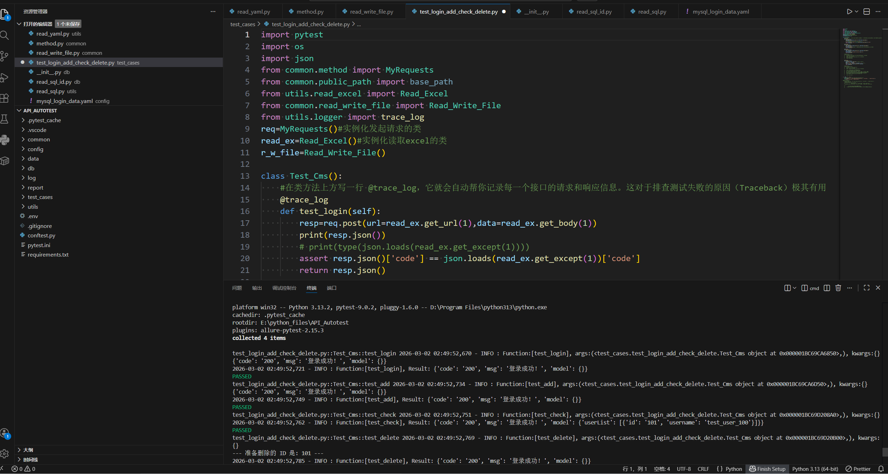
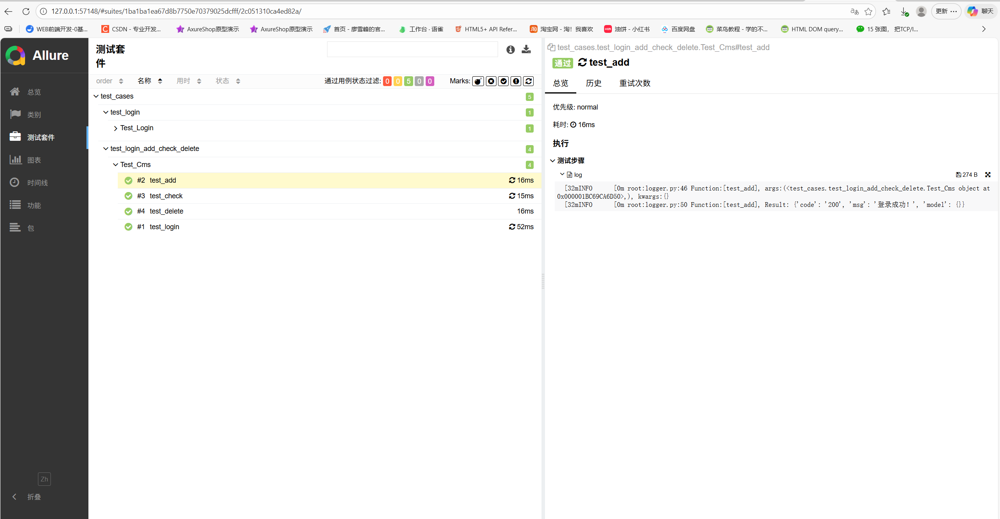

# Python 接口自动化测试框架 (Pytest 版)

[](https://www.python.org/)
[](https://docs.pytest.org/)
[](https://docs.qameta.io/allure/)

这是一个基于 **Python + Pytest** 构建的工程级接口自动化测试项目。采用**数据驱动（Data-Driven）**与**配置分离**的设计思想，适用于中大型系统的回归测试与集成测试。

---

## 🌟 核心特性

* **配置化驱动**：支持 YAML/JSON 格式的测试数据与脚本分离，降低代码耦合。
* **多环境支持**：内置环境切换逻辑，可快速在测试/预发布/生产环境间切换。
* **数据库联动**：封装了 MySQL/Redis 操作工具类，支持测试前后的数据初始化与结果断言。
* **日志全流程追踪**：集成 `logging` 模块，自动记录请求 URL、Header、Payload 及响应体。
* **可视化报告**：深度集成 Allure，支持按模块、优先级（P0/P1）查看测试覆盖率。

---

## 📁 目录结构说明

```text
├── common/               # 公共方法封装（接口请求、项目路径、读写文件）
├── config/               # 配置文件（环境地址、数据库配置、参数、动态参数、全局变量）
├── data/                 # 测试数据文件 (xls/xlsx/YAML格式)
├── db/               	  # 封装读取数据库的方法，获取表数据
├── log/                  # 运行日志（自动按日期滚动生成）
├── report/               # 生成报告文件
├── testcases/   		  # 存放组建的接口测试用例
├── utils                 # 工具类封装（YAML读取、excel读取、访问数据库、生成日志）
└── requirements.txt      # 项目依赖包列表
```

------



------



